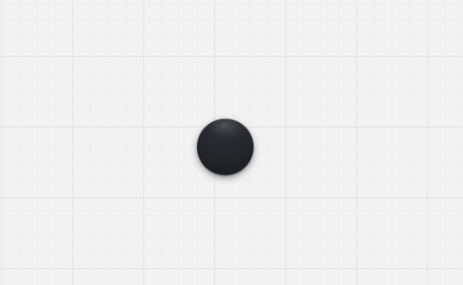

# Mote

A floating always-on-top circle for Windows, in a **1.4 MB installer**. No Electron, no
.NET, no Visual C++ redistributable — one small native binary that idles at about 25 MB
of RAM.

Drag it anywhere and it snaps to the nearest screen edge. Click it and a radial menu fans
out with a region screenshot tool and a notes pad.



## Download

**[Download the latest installer from Releases](../../releases/latest)**

Grab the `.exe` installer, run it, and Mote starts in your system tray.

### First run: Windows will warn you

The installer is unsigned, so Windows SmartScreen shows **"Windows protected your PC"**
the first time you run it. This happens to every unsigned binary — a code-signing
certificate costs a few hundred dollars a year, and this is a free project. To run it
anyway: click **More info**, then **Run anyway**.

If you would rather not, [build it from source](#build-from-source) — the result is the
same binary.

## Features

- **Draggable bubble** — throw it and it carries momentum, then springs to the nearest
  screen edge and stays there across restarts.
- **Radial menu** — click the bubble to fan the tools out around it. The arc turns to face
  inward when the bubble is near an edge or in a corner, so it never opens off-screen.
- **Screenshot** — freezes every monitor, then drag a region. The result is saved to
  `Pictures\Mote\` and copied to your clipboard. Each monitor is captured in its own
  physical pixels, so mixed-DPI setups crop correctly.
- **Notes** — a plain-text pad anchored beside the bubble. Autosaves as you type and
  persists across restarts.
- **Global hotkey** — summon the bubble to your cursor from anywhere.
- **Tray icon** — Show/Hide, Settings, Quit.
- **Start with Windows** — optional, off by default.
- **Click-through** — the window only accepts clicks on the bubble itself; everywhere else
  passes through to whatever is behind it.

## Controls

| Action | Control |
| --- | --- |
| Summon the bubble to your cursor | `Ctrl` + `Shift` + `Space` |
| Open the radial menu | Click the bubble |
| Close the menu or a panel | `Esc`, or click outside it |
| Move the bubble | Drag it — release to snap to the nearest edge |
| Select a screenshot region | Drag on the frozen screen |
| Cancel a screenshot | `Esc`, or click without dragging |
| Show/hide, settings, quit | Right-click the tray icon |

To change the summon hotkey, right-click the tray icon → **Settings**. Type a new
combination (for example `Alt+Space`) and press **Save**. If another application already
owns that combination, Mote tells you and keeps the previous one.

Settings live in `%APPDATA%\Mote\config.json`, notes in `%APPDATA%\Mote\notes.json`.

## Limitations

- A screenshot selection cannot span two monitors. Mote puts one overlay on each screen so
  that mixed-DPI setups crop correctly, and that is the trade-off.
- Mixed-DPI multi-monitor capture is written to work in each monitor's own physical pixels
  but has only been exercised on a single display.
- Notes hold a single buffer — no multiple notes or tabs.
- Windows only. It calls Win32 directly and will not run on macOS or Linux.

## Requirements

- **Windows 10 (1803 or later) or Windows 11**, 64-bit.
- **WebView2 runtime.** Ships with Windows 11 and current Windows 10; if it is missing, the
  installer fetches it. To install it manually:
  `winget install --id Microsoft.EdgeWebView2Runtime -e`

## Build from source

You need [Node.js](https://nodejs.org/) 18+, [Rust](https://rustup.rs/) (stable, MSVC
toolchain), and the Visual Studio C++ build tools that `rustup` prompts for on Windows.

```bash
git clone https://github.com/Union88github/Mote.git
cd Mote/app
npm install
npm run tauri build
```

The installer lands at
`app/src-tauri/target/release/bundle/nsis/Mote_1.0.0_x64-setup.exe` (~1.4 MB). A standalone
`mote.exe` is also produced in `app/src-tauri/target/release/`, if you would rather not
install anything.

The first build compiles the whole Rust dependency tree and takes roughly 20 minutes;
later builds are far quicker.

To run it in development instead, with hot reload:

```bash
npm run tauri dev
```

To run the test suite:

```bash
npm test
```

Maintainer notes — regenerating the icon, cutting a release — are in
[docs/MAINTAINING.md](docs/MAINTAINING.md).

## License

MIT — see [LICENSE](LICENSE).
